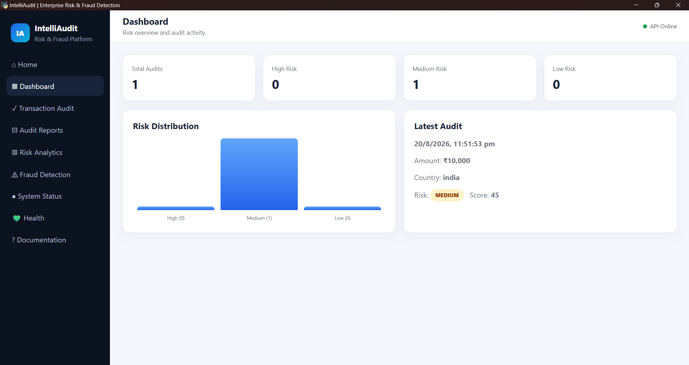
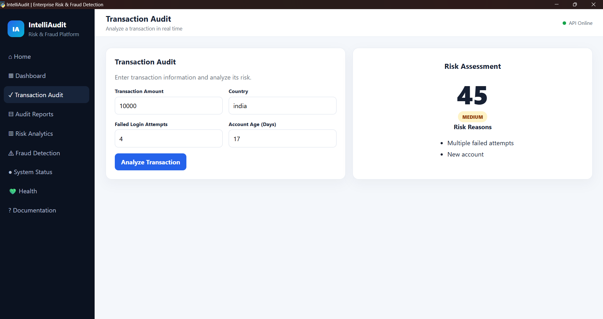

# IntelliAudit

AI-powered enterprise risk & fraud detection web application.

## About

IntelliAudit is a full-stack web application that analyzes financial transactions and flags potential fraud risk in real time. It was built as a hands-on project to practice full-stack development — connecting a Python backend to an interactive frontend dashboard.

## Features

-  **Dashboard** — overview of risk distribution and recent audit activity
-  **Transaction Audit** — submit transaction details and get an instant risk score
-  **Audit Reports** — history of all analyzed transactions
-  **Risk Analytics** — visual breakdown of risk trends
-  **Fraud Detection** — flags suspicious patterns
-  **Health Check** — live API status monitor
-  **System Status** — backend connectivity check

## Tech Stack

- **Backend**: Python, FastAPI, Uvicorn
- **Frontend**: HTML, CSS, JavaScript (vanilla, no framework)
- **Desktop App**: pywebview (runs as a standalone window)

## How It Works

1. User submits transaction details (amount, country, failed login attempts, account age) through the Transaction Audit page
2. The FastAPI backend applies rule-based risk scoring logic
3. A risk score and risk level (Low/Medium/High) are returned instantly
4. Results are displayed and stored in the Audit Reports history

## Screenshots




## Running Locally

**Requirements:** Python 3.10+

```bash
cd backend
pip install fastapi uvicorn pydantic
uvicorn app.main:app --reload
